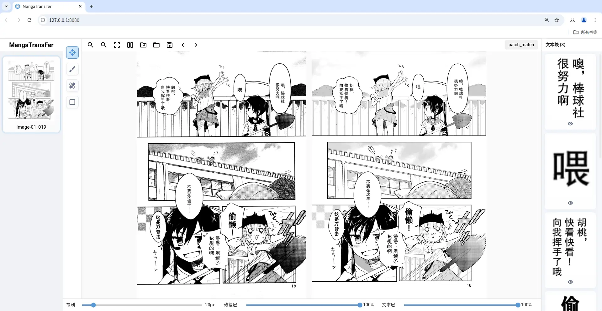
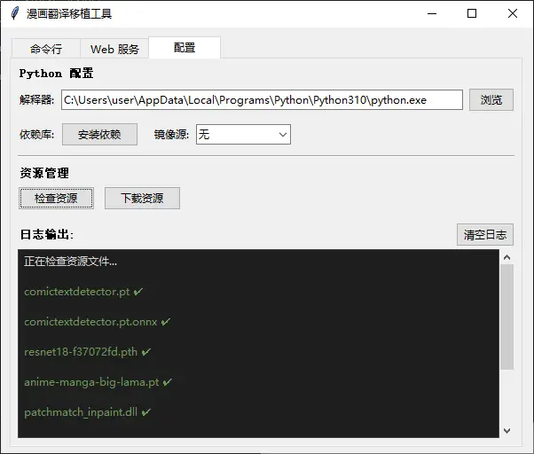

# MangaTransFer - 漫画翻译移植

带露折花，色香自然要好得多；昔时不能够，今以朝花夕拾，终可为之。


<p align="center">界面预览</p>

## 快速开始

### 环境要求
- Python 3.10.6 [下载](https://www.python.org/downloads/release/python-3106/)

### 下载
```bash
git clone https://github.com/30A430AB/MangaTransFer.git&&cd MangaTransFer
```

### 运行
```bash
python launcher.py
```
初次运行需点击配置页安装依赖和下载资源


#### 工具说明
- 修复画笔：按下鼠标左键拖动抹除文字
- 还原画笔：按下鼠标左键拖动清除修复结果
- 矩形工具：按下鼠标左键拖动矩形框抹除框内文字

## 致谢

- [BallonsTranslator](https://github.com/dmMaze/BallonsTranslator)
- [comic-text-detector](https://github.com/dmMaze/comic-text-detector)
- [PyPatchMatch](https://github.com/vacancy/PyPatchMatch) [修改版](https://github.com/dmMaze/PyPatchMatchInpaint)
- [lama](https://github.com/advimman/lama) [微调版](https://huggingface.co/dreMaz/AnimeMangaInpainting) [simple-lama-inpainting](https://github.com/enesmsahin/simple-lama-inpainting)
- [resnet18](https://github.com/pytorch/vision) 
- [nicegui](https://github.com/zauberzeug/nicegui) 
- [fabric.js](https://github.com/fabricjs/fabric.js) 
