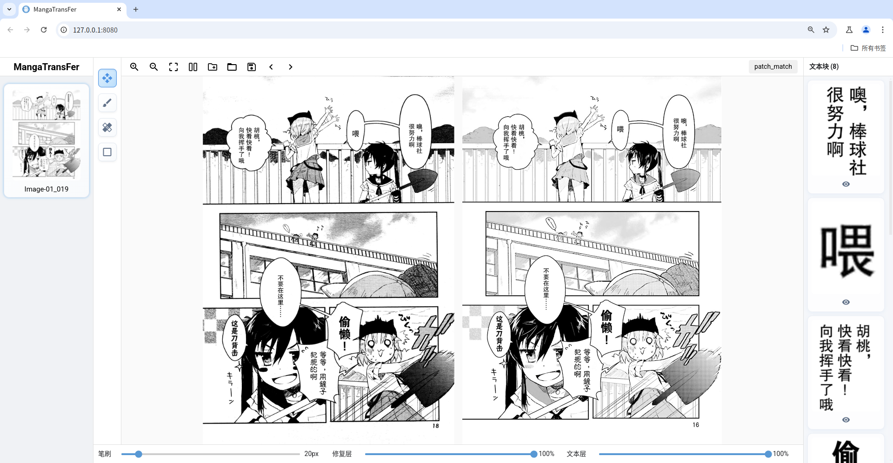

# MangaTransFer

带露折花，色香自然要好得多；昔时不能够，今以朝花夕拾，终可为之。


<p align="center">界面预览</p>

## 快速开始

### 环境要求
- Python 3.10.6

### 下载
1. 克隆仓库
  ```bash
git clone https://github.com/30A430AB/MangaTransFer.git&&cd MangaTransFer
```
2. 手动下载 [data](https://github.com/30A430AB/MangaTransFer/releases/download/v0.1.0/data.zip) 文件夹，解压后放于源码目录下的对应位置

3. 安装依赖
```bash
pip install -r requirements.txt
```
## 使用

### 命令行模式
```bash
python cli.py <原始图片文件夹路径> <文本图片文件夹路径> [--automatch {true,false}]
```

|  参数   | 必填  |  默认   | 描述  |
|  ----  | ----  |  ----  | ----  |
| raw_dir  | 是 | 无  | 原始图片目录路径 |
| text_dir  | 是 | 无  | 文本图片目录路径 |
| --automatch  | 否 | true  | 是否自动匹配图片。若为 false，则要求两边图片文件名必须一致 |

### GUI 模式
```bash
python gui.py
```

#### 工具说明
- 修复画笔：按下鼠标左键拖动抹除文字
- 还原画笔：按下鼠标左键拖动清除修复结果
- 矩形工具：按下鼠标左键拖动矩形框抹除框内文字

## 致谢

本项目使用了以下开源项目
- [BallonsTranslator](https://github.com/dmMaze/BallonsTranslator)
- [comic-text-detector](https://github.com/dmMaze/comic-text-detector)
- [patchmatch](https://github.com/vacancy/PyPatchMatch) [修改版](https://github.com/dmMaze/PyPatchMatchInpaint)
- [lama](https://github.com/advimman/lama) [微调版](https://huggingface.co/dreMaz/AnimeMangaInpainting) [simple-lama-inpainting](https://github.com/enesmsahin/simple-lama-inpainting)
- [resnet18](https://github.com/pytorch/vision)
